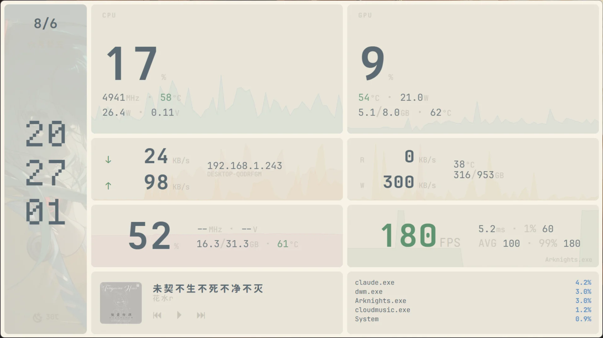
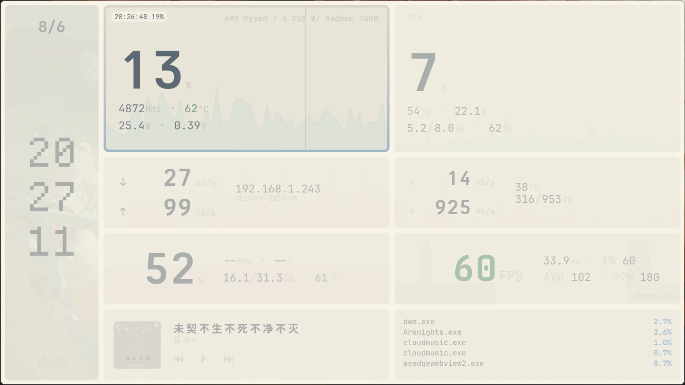
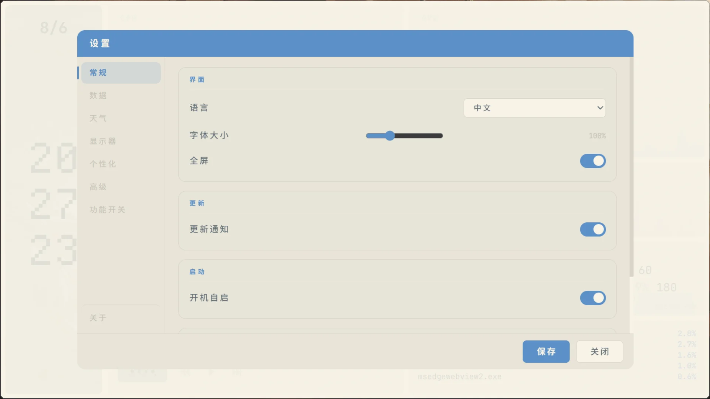
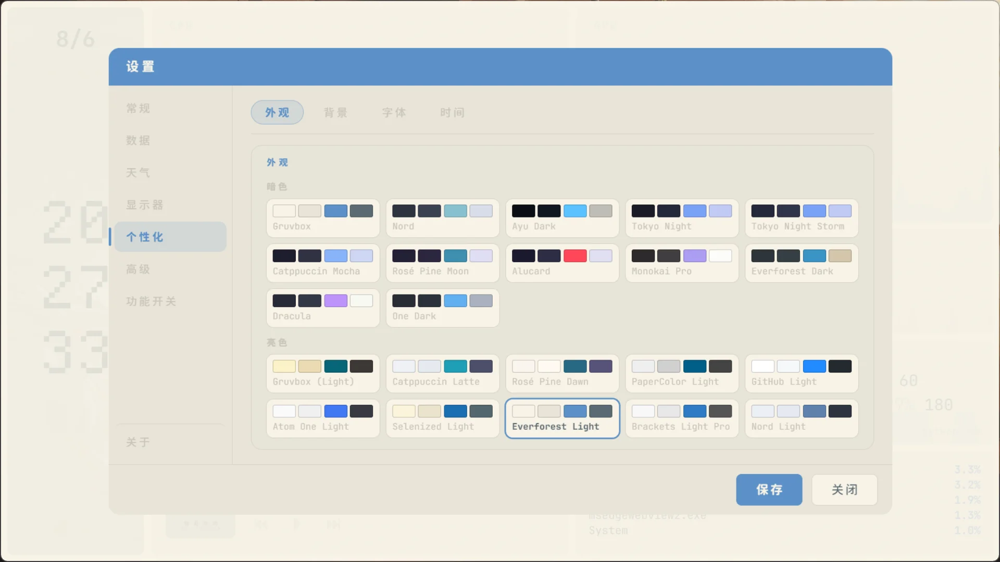
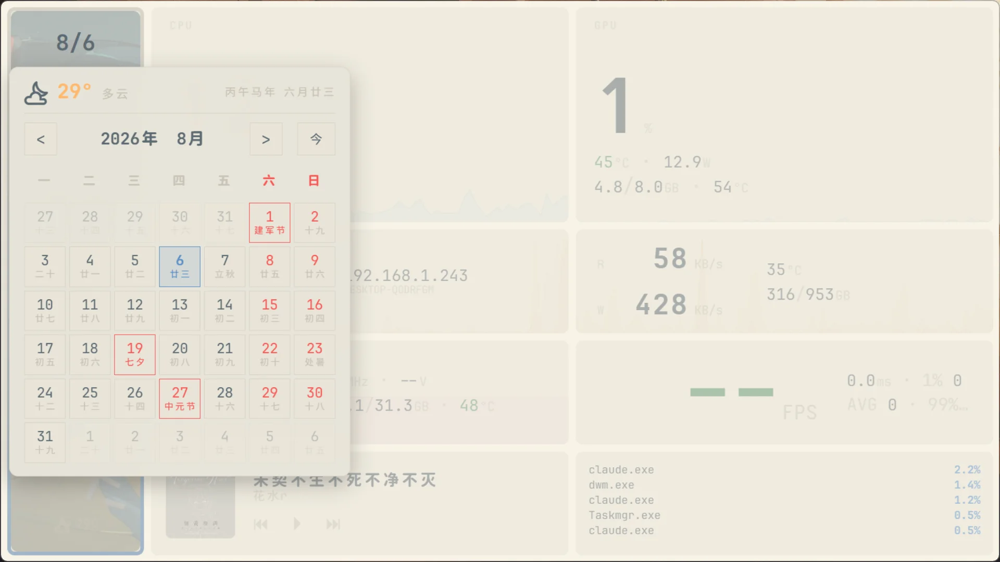
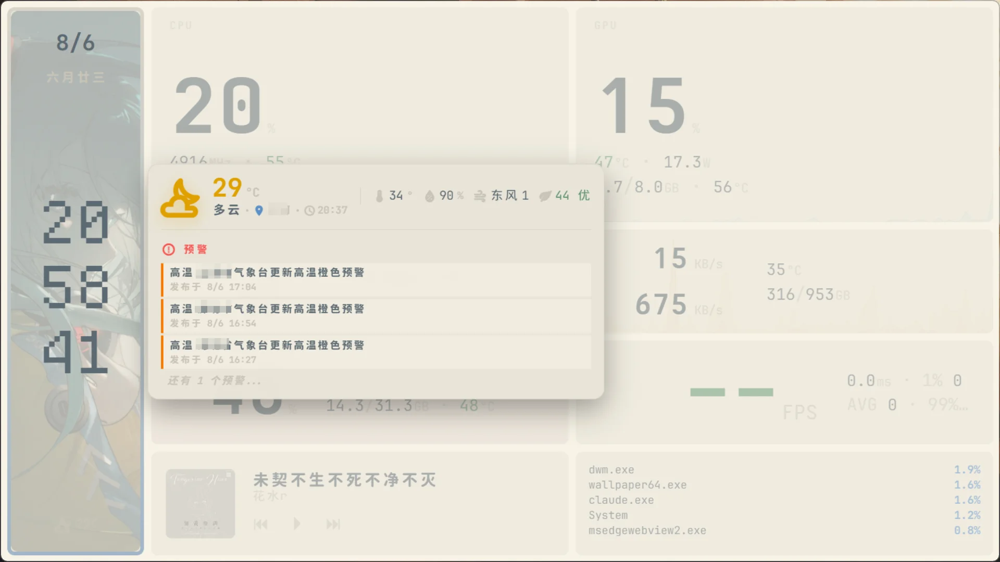

<div align="center">
  

# MoMoitor

基于 Python + PyWebview，专为副屏设计的 Windows 系统监视应用。让你在副屏上扫一眼即可查看电脑的各项状态。


---

</div>

## 特性

- 实时呈现 CPU / GPU / 内存 / 网络 / 磁盘 / 进程等关键指标。
- 支持 LibreHardwareMonitor，或通过 [HWiNFO](https://www.hwinfo.com/) 共享内存读取数据（需自行下载并开启共享内存）。
- 显示时间、日历，日历支持显示农历、黄历、法定节假日及调休。
- 接入和风天气 API，提供实时天气、降水预报、空气质量指数及灾害预警等数据。
- 获取当前播放媒体信息，可控制播放/暂停、上一首/下一首。
- 内置多套配色方案，并允许自定义时钟区域背景图，满足视觉差异化需求。
- 通过 [RTSS](https://www.guru3d.com/download/rtss-rivatuner-statistics-server-download/)，实时读取游戏帧率，附加 1% Low 帧与帧生成延迟数据（需在后台运行 RTSS）。
- 支持启动时强制绑定至特定显示器，程序启动后自动定位至指定屏幕，适用于多显示环境。
- WebView 渲染进程与主进程合计 CPU 占用 < 2%，GPU 占用峰值 ≤ 0.5%，对系统负载影响极小。
- 将鼠标放到界面顶部，即可快速调节显示亮度、系统音量。
- 可选启用服务端模式。启用后，将启动一个 Web 服务器，你可以在浏览器上打开，这样你就可以在手机、平板等设备上使用而无需第二个显示器。
- 点击内存占用率，可快速清理内存，连续点击可进行深度清理。
- 点击 IP 地址，可查看监听端口列表，快速找出哪个程序占用了哪个端口。
- 点击上传 / 下载，可查看流量使用信息，直观查看最近下了多少 GB，以及哪个程序所用流量最多。
- 支持显示当前播放的音乐歌词。(需要先在设置中配置 Meting API)

## 界面一览

| 主界面 | 鼠标放到监控项时的样式 |
| :-: | :-: |
|  ||

| 设置界面 | 个性化设置 |
| :-: | :-: |
|  |  |

| 日历 | 天气 |
| :-: | :-: |
|  |  |

## 环境要求

- Windows 10 / 11（x64）
- [WebView2 Runtime](https://developer.microsoft.com/microsoft-edge/webview2/)（Win11 通常已内置，Win10 随 Edge 安装）
- .NET Framework 4.8（Win10/11 内置）

**可选安装以下内容**

- [HWiNFO](https://www.hwinfo.com/) 提供 HWiNFO 数据源，相比 LHM 可以显示内存电压，CPU 电压或许也会显示的更准确。
- [RTSS](https://www.guru3d.com/download/rtss-rivatuner-statistics-server-download/) 显示帧率信息，必须确保 RTSS 在运行才能显示。

## 安装

### Releases

从 [Releases](https://github.com/realCreeper938/MoMoitor/releases) 下载
`MoMoitor-v{version}-win64.zip`，解压后运行 `MoMoitor.exe`。

**开机自启基于注册表 Run 键实现（HKCU），无需管理员权限即可设置。**

### 从源码运行

**如遇 Bug，建议尝试从源码运行，测试 Bug 是否能够复现，并记录日志。**

首先 Clone 本项目到本地，或者 [Download ZIP](https://github.com/realCreeper938/MoMoitor/archive/refs/heads/main.zip)。

打开一个管理员权限的终端/CMD，运行以下指令:
```bash
pip install -r requirements.txt # 补全依赖
python -m momoitor.main        # 启动桌面窗口
```

或者直接打开 `start.bat`。

## 用法

启动程序后，按 `S` 键打开设置。

若要使用天气功能，需要配置和风天气的密钥。

<details>

<summary>配置天气功能</summary>

1. 打开 [和风天气控制台](https://console.qweather.com/project)，登录或注册账号。
2. 创建一个项目。名称任意。
3. 将 “项目 ID” 填入到设置 - 天气 - 项目 ID。
4. 创建一个凭据。名称任意。
5. 按下 F12，打开浏览器控制台，运行以下内容。

```javascript
async function generateEd25519Pem() {
  const k = await crypto.subtle.generateKey({name:"Ed25519"},true,["sign","verify"]);
  const p8 = await crypto.subtle.exportKey("pkcs8",k.privateKey);
  const spki = await crypto.subtle.exportKey("spki",k.publicKey);
  const pem = (d,t)=>{
    let b=btoa(String.fromCharCode(...new Uint8Array(d)));
    return`-----BEGIN ${t}-----\n${b.match(/.{1,64}/g).join("\n")}\n-----END ${t}-----`;
  };
  const priv=pem(p8,"PRIVATE KEY");
  const pub=pem(spki,"PUBLIC KEY");
  console.log("PrivateKey:\n",priv,"\n\nPublicKey:\n",pub);
  return{priv,pub};
}
generateEd25519Pem();
```

6. 复制输出的公钥 (PublicKey，不含 PublicKey 自身)，填入到和风天气控制台的公钥内。
7. 将 “凭据 ID” 填入到设置 - 天气 - 凭据 ID。
8. 将浏览器控制台输出的私钥 (PrivateKey，不含 PrivateKey 自身)，填入到设置 - 天气 - 私钥。
9. 保存天气设置。
10. 若要更改位置，直接在网上搜索你所在位置的经纬度并填入即可，也可到[和风天气常用地区列表](https://github.com/qwd/LocationList)查询。
</details>

## 构建

```bash
pip install -r requirements-dev.txt
python scripts/build.py check       # 语法检查
python scripts/build.py build       # PyInstaller onedir → dist/MoMoitor-v*.zip
python scripts/build.py icon        # 重新生成应用图标
python scripts/build.py run         # 开发模式启动
```

构建产物位于 `dist/`，数据写入 `%LOCALAPPDATA%\MoMoitor`（源码运行时为项目内 `data/`）。

## 常见问题

* **为什么不显示歌词？** 请先在设置 - 数据 - 歌词中配置 Meting API，并确保播放音乐的进程在白名单内 (若不在可自行填写)。如果仍不显示，检查音乐播放器是否已开启 SMTC，是否能获取到当前播放进度。(比如某易云就不支持获取播放进度，导致不显示歌词)

* **有没有支持 Linux 的计划？** 由于使用了太多 Windows 独有的特性和 API，Linux 适配过于复杂，未来可期

## Todo

- [ ] 插件系统
- [ ] 允许调整布局

## 许可证

本项目使用 [MIT License](LICENSE) 开源。

随包分发的第三方组件（许可文本见 `LICENSES/`）：

| 组件 | 位置 | 许可证 |
|---|---|---|
| LibreHardwareMonitor | `momoitor/libs/` | [MPL-2.0](LICENSES/MPL-2.0.txt)（源码：https://github.com/LibreHardwareMonitor/LibreHardwareMonitor ，未修改分发） |
| JetBrains Maple Mono | `momoitor/web/fonts/` | [OFL-1.1](LICENSES/OFL-1.1.txt) |
| Departure Mono | `momoitor/web/fonts/` | [OFL-1.1](LICENSES/OFL-1.1.txt) |
| IoskeleyMono | `momoitor/web/fonts/` | [OFL-1.1](LICENSES/OFL-1.1.txt) |
| Symbols Nerd Font Mono | `momoitor/web/fonts/` | [MIT](LICENSES/MIT.txt) |
